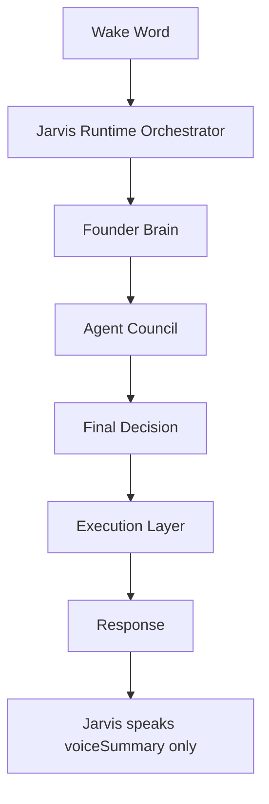

# Jarvis Runtime Orchestrator

Jarvis Runtime Orchestrator is the single runtime entry point for voice, phone, and future OS surfaces.

It connects existing systems without letting them speak independently.



## Runtime Contract

- Single entry point: `runJarvisRuntime(...)`
- Single HTTP path: `POST /jarvis/runtime`
- Founder Brain remains the decision engine.
- Agent Council reviews internally and never speaks directly to the founder.
- Execution Layer prepares actions only and requires confirmation.
- Jarvis response is always `voiceSummary`.

## Response Shape

```json
{
  "runtime": "JARVIS_RUNTIME_ORCHESTRATOR_V1",
  "flow": [
    "wake_word",
    "jarvis_runtime",
    "founder_brain",
    "agent_council",
    "final_decision",
    "execution_layer",
    "response"
  ],
  "response": "Jarvis speaks this.",
  "spokenResponse": "Jarvis speaks this.",
  "voiceSummary": "Jarvis speaks this."
}
```

## Safety

This runtime does not make agents autonomous.

It only unifies routing:

- Founder Brain decides.
- Council reviews.
- Execution Layer gates action.
- Founder approval remains required before execution.
